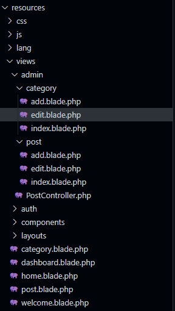
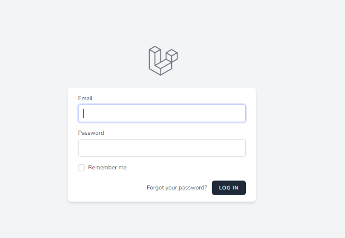
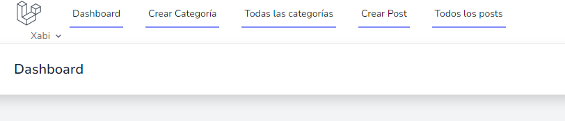
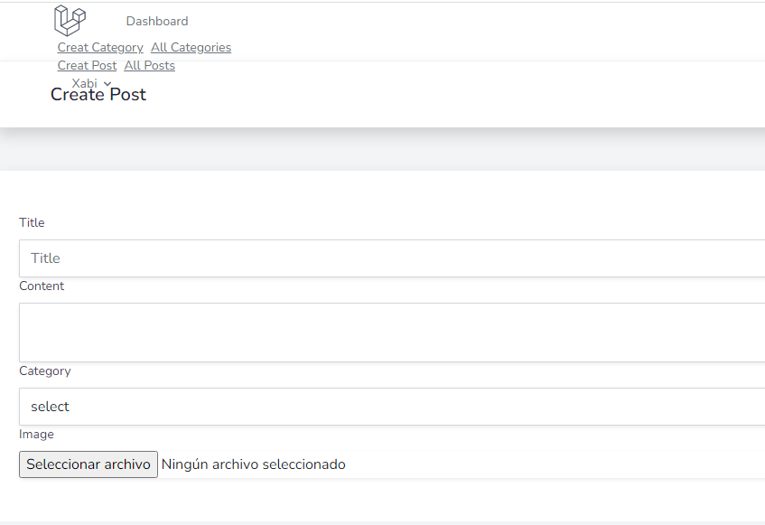
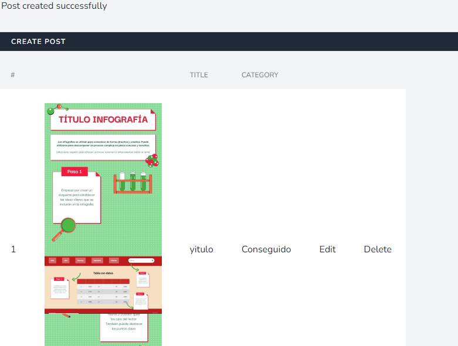

# cms-laravel

Velaquí un cms de Laravel feito enteiramente desde a terminal salvo algún axuste no visual studio code dos distintos arquivos de PHP.

## O proceso

Desde a terminal de Laragon instalamos o Laravel Breeze para poder crear un proxecto de Laravel 8. A este proxecto o chamamos cms-laravel. 

```
composer create-project laravel/laravel lara-breeze-cms --prefer-dist
composer require laravel/breeze --dev
php artisan breeze:install
```

Compilamos os assets e máis tarde configuramos a base de datos "lara_breeze_cms" para poder conectarnos a ela. Migramos a base de datos e creamos tablas de contido dentro.

## PHP

Configuramos as rutas para poder facer posts e categorías dentro da nosa web. para isto, facemos un post.php e un category.php e lles negadimos un controlador. Logo, facemos unha carpeta admin e introducimos todas as blades que lle permiten navegar as distintas partes seguindo esta estructura en árbore:



Tras configurar homecontroller, xa temos a nosa web funcional e a podemos visitar.

## A web que temos

A web empeza cun login que nos pide usuario e contrasinal. 



Se nos temos rexistrado previamente a través de public/register) poderemos entrar na páxina principal:



Dende aquí cremaos unha categoría nova de post:



Unha vez feita polo menos unha categoría, podemos crear un post e clasificalo como esa categoría:



Como podes ver, a páxina enteira funciona perfectamente. Neste punto o único que queda é meterlle bootstrap e modificar os estilos para que resulte máis presentable.
